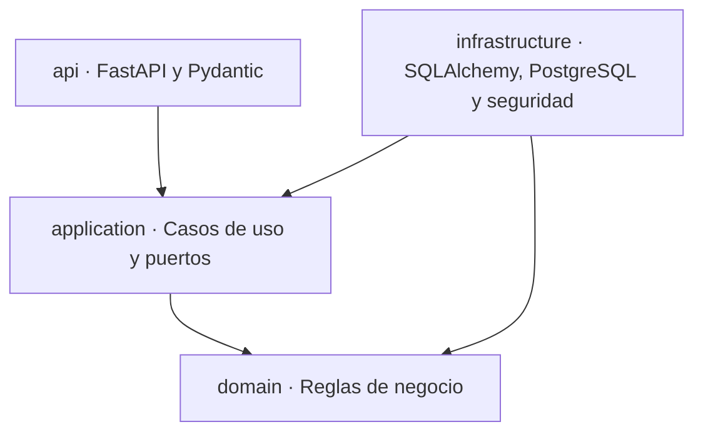

# ADR-001: Arquitectura del backend de Medalyze

| Campo | Valor |
|---|---|
| Estado | `Propuesto` |
| Fecha | 02/10/2026 |
| Responsables | Equipo frontend y arquitectura de Medalyze |
| Ticket relacionado | ARQ-01 · Arquitectura del backend definida |
| Repositorio | `medalyze-backend` |
| Rama | `docs/ARQ-01-arquitectura-backend` |
| ADR relacionado | `medalyze-frontend/docs/adr/ADR-002-arquitectura-frontend.md` |

---

## Contexto

Medalyze es un sistema de costeo para consultorios dentales. Calcula el costo de prestar un tratamiento y sugiere un precio a partir de gastos indirectos, capacidad de atención, tiempo clínico y materiales utilizados.

El sistema maneja información financiera que debe ser precisa, trazable y reproducible. Una hoja de costos guardada no debe cambiar cuando posteriormente se modifiquen precios, insumos, tratamientos o configuraciones.

El prototipo anterior mezclaba navegación, persistencia, acceso a datos y reglas de negocio. También utilizaba una API legacy basada en `/shared-*`. El nuevo backend se construirá en `medalyze-backend`, separado de `medalyze-frontend`, con límites explícitos entre el dominio, los casos de uso, la infraestructura y HTTP.

## Problema

Sin una arquitectura común, los routers podrían contener fórmulas financieras, la persistencia podría acoplarse al dominio, las transacciones podrían dejar resultados parciales y una organización podría acceder accidentalmente a información de otra.

También se requiere un contrato estable para que el frontend pueda desarrollar rutas, formularios, mocks, tratamiento de errores y tipos sin depender de detalles internos del backend.

## Fuerzas de decisión

- El motor de costeo debe probarse sin FastAPI ni PostgreSQL.
- Los cálculos monetarios deben usar precisión decimal.
- Las escrituras deben ser atómicas.
- Los datos deben aislarse por organización.
- Frontend y backend deben compartir un único contrato OpenAPI.
- Las rutas, campos, errores y conceptos del negocio deben conservar una terminología coherente en español.
- La arquitectura debe admitir pruebas unitarias, integración y recorridos completos.

## Decisión

Se adopta una arquitectura por capas inspirada en Onion/Clean Architecture. Las dependencias de código apuntan hacia las capas internas y el dominio no importa frameworks ni adaptadores externos.



La secuencia de ejecución de una solicitud puede atravesar `api → application → infrastructure`, pero esa secuencia no representa la dirección de las dependencias de código. `Infrastructure` implementa interfaces definidas por las capas internas.

## Capas

### `domain`

Contiene reglas, entidades, tipos de valor y servicios de dominio. El motor de cálculo reside en `domain/costeo/` y utiliza Python puro.

No importa:

- FastAPI;
- SQLAlchemy;
- Pydantic;
- PostgreSQL;
- Argon2;
- JWT;
- clientes HTTP.

El dominio del motor de costeo incluye, entre otros, `Dinero`, `Minutos`, `Porcentaje`, gastos, equipos, capacidad, tratamientos, materiales, política de precio, bloqueos y resultados de cálculo. El detalle completo, clase por clase (46 elementos, incluidas 7 enumeraciones), vive en `ARQ-01-tabla-clases-modulos.md`.

### `application`

Contiene casos de uso y puertos. Coordina el dominio, controla los límites transaccionales y depende de abstracciones, no de implementaciones SQLAlchemy.

Ejemplos:

- emitir una hoja de costos;
- obtener una vista previa;
- guardar la configuración de un tratamiento;
- consultar historial;
- administrar insumos y períodos mensuales.

### `infrastructure`

Contiene adaptadores y detalles técnicos:

- implementaciones SQLAlchemy de los repositorios;
- conexión y transacciones PostgreSQL;
- aplicación del contexto de organización;
- Argon2 para contraseñas;
- creación y validación de tokens;
- configuración por ambiente.

### `api`

Contiene routers FastAPI, dependencias HTTP y esquemas Pydantic. Traduce solicitudes HTTP a casos de uso y sus resultados a respuestas del contrato OpenAPI.

No contiene fórmulas financieras ni consultas directas que eludan `application`.

## Módulos funcionales

Se definen los 12 módulos indicados por ARQ-01:

| Módulo | Responsabilidad principal |
|---|---|
| `autenticacion` | Registro, inicio, renovación, cierre de sesión y usuario actual. |
| `cuenta` | Perfil del usuario y organización. |
| `onboarding` | Progreso, situación, especialidades y selección inicial. |
| `capacidad` | Perfil de atención, disponibilidad y capacidad mensual. |
| `gastos` | Gastos recurrentes y periodicidades. |
| `equipos` | Equipos, depreciación y costos asociados. |
| `insumos` | Unidades, insumos, precios, archivo y restauración. |
| `mensuales` | Períodos mensuales, correcciones y promedios. |
| `plantillas` | Plantillas de tratamiento y materiales sugeridos. |
| `tratamientos` | Configuración, materiales y estado de tratamientos. |
| `costeo` | Vista previa, cálculo, hojas de costos y bloqueos. |
| `inicio` | Resumen y agregaciones para la pantalla principal. |

Los nombres internos deben mantenerse consistentes en el C3, la tabla clase → módulo, OpenAPI y el código. La API puede utilizar recursos como `/periodos-mensuales`, mientras el módulo arquitectónico se denomina `mensuales`.

> **Nota de consolidación:** se verificó `ARQ-01-tabla-clases-modulos.md` —
> ya usa `mensuales` de forma consistente en sus 46 filas. El único lugar
> que decía `periodos_mensuales` era este mismo ADR, ya corregido aquí.

## Reglas de dependencia

- `domain` no importa ninguna de las otras capas.
- `application` depende del dominio y define los puertos requeridos.
- `infrastructure` implementa los puertos de `application`.
- `api` consume casos de uso de `application`.
- Un router no accede directamente a tablas ni contiene fórmulas.
- Un módulo no accede al repositorio interno de otro; la colaboración se realiza mediante contratos explícitos.
- Las interfaces de repositorio pertenecen a las capas internas y no a SQLAlchemy.

## Librerías y versiones

Estas versiones **ya están verificadas** — se confirmaron al revisar la
documentación técnica del repositorio previo del proyecto
(`ARQUITECTURA.md` y `BACKEND.md` del prototipo) antes del reinicio. No son
una propuesta a discutir desde cero: son el punto de partida conocido.
Quedan pendientes de **reconfirmar** en el `pyproject.toml`/`uv.lock` del
repositorio `medalyze-backend` nuevo, ya que está vacío al momento de este
ADR.

| Necesidad | Decisión | Versión verificada en el proyecto previo | Alternativas consideradas |
|---|---|---|---|
| Lenguaje | Python | 3.12 | — (fijado por el equipo desde el inicio) |
| Framework HTTP | FastAPI | 0.141.1 | Flask; descartado, ver "Alternativas descartadas" |
| ORM | SQLAlchemy | 2.0.43, **síncrono** | Acceso SQL directo sin ORM; se descarta por perder tipado y migraciones |
| Acceso a datos | Síncrono (no `AsyncSession`) | Confirmado en el proyecto previo | Async; no se adopta sin justificación — ver "Decisiones pendientes" si se quiere reabrir con evidencia nueva |
| Migraciones | Alembic | 1.16.5 | Sin alternativa evaluada; confirmada en el proyecto previo |
| Driver PostgreSQL | psycopg | 3.2.9 | psycopg2; se prefiere la versión 3 por soporte nativo de tipos |
| Validación | Pydantic | v2 (según FastAPI 0.141.1) | — |
| Autenticación | JWT propio (PyJWT) | 2.14.0 | Auth nativo del proveedor de base de datos; descartado, ver "Alternativas descartadas" |
| Hash de contraseñas | Argon2 | Confirmado; versión exacta pendiente de fijar en el repo nuevo | bcrypt; Argon2 es el ganador actual de la competencia de hashing de contraseñas |
| Pruebas | pytest | Pendiente de fijar versión en el repo nuevo | — |
| Contenedores | Docker | Pendiente de aprobar en BE-01 | — |

## Integración con el frontend

ADR-002 establece que el frontend considera autoritativos los datos, permisos, validaciones y cálculos recibidos del backend. La integración se rige por estas reglas:

1. `docs/api/openapi.yaml` es la fuente de verdad del contrato HTTP.
2. El frontend genera sus tipos a partir del contrato aprobado.
3. Los mocks de MSW deben respetar el mismo contrato.
4. El frontend no reimplementa las fórmulas oficiales de costeo.
5. La vista previa se calcula en el servidor y no guarda información ni produce efectos secundarios.
6. Sólo una respuesta exitosa permite mostrar una operación como guardada.
7. Los cambios al contrato se realizan mediante Pull Request.

El debounce de 400 ms pertenece al frontend. El backend debe permitir cancelar o ignorar solicitudes obsoletas sin convertir una vista previa en una escritura.

## Autenticación y sesión

El contrato de autenticación establece:

- token de acceso JWT con vigencia de 15 minutos;
- token de actualización opaco con vigencia de 7 días;
- rotación del token de actualización en cada renovación;
- revocación del token de actualización al cerrar sesión;
- endpoints de registro, inicio, renovación, cierre y usuario actual.

El mecanismo exacto de transporte y almacenamiento del token de actualización debe cerrarse conjuntamente con ADR-002 y ARQ-03. La opción propuesta es:

- access token entregado al cliente y enviado como `Authorization: Bearer`;
- refresh token en cookie `HttpOnly`, `Secure` y con política `SameSite` acordada;
- protección CSRF cuando corresponda;
- una única renovación coordinada ante solicitudes concurrentes;
- `POST /autenticacion/cierre-sesion` revoca la sesión del servidor.

Esta opción permanece pendiente de aprobación hasta quedar reflejada sin ambigüedad en OpenAPI y en la configuración CORS/cookies del entorno.

## Transacciones

Cada caso de uso de escritura controla una única transacción. Los repositorios utilizados durante el caso de uso comparten la misma sesión y conexión.

Emitir una hoja de costos es atómico:

1. se cargan los datos requeridos;
2. `SistemaCosteo` calcula el resultado;
3. se validan bloqueos y precondiciones;
4. se guarda la hoja y sus colecciones hijas;
5. se confirma la transacción.

Si cualquiera de esos pasos falla, se revierte la operación completa. No puede quedar una hoja parcial, una receta nueva asociada a un resultado anterior ni una confirmación falsa para el frontend.

## Aislamiento por organización

El aislamiento se aplica en dos niveles:

1. La API obtiene la organización autorizada desde la sesión, nunca desde un valor libre enviado por el cliente.
2. La infraestructura abre la transacción y ejecuta `SET LOCAL app.organizacion_id = ...` en la misma conexión antes de cualquier consulta protegida.
3. PostgreSQL aplica políticas RLS sobre `identificador_organizacion`.

Un recurso inexistente o perteneciente a otra organización responde 404. Un usuario autenticado que pertenece a la organización pero carece del rol necesario recibe 403.

ADR-002 complementa esta protección separando y limpiando la caché por organización y usuario. La separación del frontend mejora la experiencia, pero no sustituye RLS ni la autorización del backend.

## Concurrencia

Las entidades editables utilizan revisión optimista por recurso. Cuando la revisión del cliente no coincide con la vigente, el backend no sobrescribe los datos y devuelve `409 CONFLICTO_REVISION`.

Cuando una operación exige que el cliente proporcione una revisión y ésta falta, devuelve `428 REVISION_REQUERIDA`. El frontend conserva el borrador, obtiene la versión vigente y permite resolver el conflicto antes de reintentar.

No se conserva el modelo legacy de un único `expected_revision` para documentos `/shared-*` completos.

## Errores

Un manejador común transforma errores de dominio y aplicación al formato definido por ARQ-03:

```json
{
  "detalle": {
    "codigo": "CONFLICTO_REVISION",
    "mensaje": "Los datos fueron modificados",
    "campos": []
  }
}
```

El catálogo debe cubrir 401, 403, 404, 409, 422, 428 y 500. El frontend utiliza el código estable para decidir la experiencia y conserva el mensaje del contrato cuando no existe un error asociado a un campo.

## Configuración

La configuración se obtiene mediante Pydantic Settings y variables de entorno. Como mínimo:

```text
DATABASE_URL
JWT_SECRET
JWT_ACCESS_TTL_MIN=15
REFRESH_TTL_DAYS=7
CORS_ORIGINS
APP_VERSION
```

No se versionan secretos ni archivos `.env` reales.

## Convenciones de nombres

- Rutas, campos JSON, códigos de error y conceptos del negocio se expresan en español.
- Se utiliza `identificador` en el contrato público en lugar de `id`.
- Se conserva terminología contable precisa: costo, costo ajustado, precio sugerido y margen.
- Los nombres técnicos de carpetas deben ser consistentes entre módulos y ADR; cualquier excepción se documenta.

## Estrategia y pruebas arquitectónicas

- El paquete de dominio se prueba sin FastAPI ni base de datos.
- Banco de escenarios y pruebas basadas en propiedades (Hypothesis) sobre el motor de costos, con cobertura de dominio objetivo ≥ 90 % (fijado por CAL-07).
- Las reglas de importación se verifican automáticamente para impedir dependencias externas desde `domain`.
- Los adaptadores se prueban mediante integración con PostgreSQL real (restricciones, columnas generadas, RLS e inmutabilidad de tablas de solo inserción — fijado por BE-02).
- Las transacciones verifican rollback ante fallas intermedias.
- Las pruebas de aislamiento utilizan al menos dos organizaciones.
- Los escenarios del motor se comparan con el manual y el banco oficial.
- El contrato OpenAPI se valida en CI y genera tipos TypeScript sin error (ya resuelto en ARQ-03).

## Alternativas descartadas

| Alternativa | Motivo del descarte |
|---|---|
| Fórmulas dentro de routers | Mezcla HTTP con negocio y dificulta pruebas aisladas. |
| Carpeta genérica `helpers` para el costeo | Oculta responsabilidades propias del dominio. |
| Singleton con estado para las fórmulas | Introduce estado global y reduce determinismo; se propuso en una sesión técnica temprana y se descartó formalmente. |
| `float` para dinero | Produce errores de precisión; se utiliza `Decimal` desde el dominio hasta la base de datos (`numeric`). |
| Acceso directo de routers a SQLAlchemy | Omite casos de uso, transacciones y puertos. |
| API legacy `/shared-*` | Acopla recursos completos y genera conflictos demasiado amplios; un cambio en un insumo bloqueaba la edición de otro no relacionado. |
| Autorización únicamente en frontend | No protege datos ni sustituye RLS y permisos del servidor. |
| Usar Supabase Auth en vez de JWT propio | El backend no depende del proveedor de base de datos para identidad; Supabase se usa solo como motor de PostgreSQL administrado. |
| Copiar la estructura de un proyecto de referencia en otro stack (TypeScript/Mongoose) | No es idiomático en Python/FastAPI; se usó solo como ejemplo didáctico en una asesoría. |

## Consecuencias positivas

- El motor de costeo puede probarse y auditarse de forma aislada.
- Las fórmulas no dependen del framework HTTP ni de la base de datos.
- Frontend y backend se integran mediante un contrato explícito.
- Las escrituras evitan estados parciales.
- El aislamiento se refuerza en aplicación y PostgreSQL.
- Los módulos pueden evolucionar sin acceso directo a sus detalles internos.

## Consecuencias negativas y riesgos

- Los puertos y adaptadores incrementan el número de componentes.
- Las transacciones requieren compartir correctamente sesión y conexión.
- RLS exige pruebas específicas y configuración rigurosa por request.
- La rotación de tokens requiere coordinación entre backend, frontend y múltiples solicitudes.
- Una divergencia entre OpenAPI, implementación, mocks y tipos generados bloquearía la integración.
- Mantener 12 módulos con límites estrictos exige disciplina — es más fácil ubicar una clase nueva por conveniencia que respetar la tabla clase → módulo.

## Decisiones pendientes

- Confirmar el transporte y almacenamiento definitivo del refresh token con ADR-002 y ARQ-03.
- Formato final de `margen_estimado_porcentaje` en base de datos: `43.5400` o `0.4354` — ningún documento lo aclara con un ×100 explícito.
- Precisión del factor de periodicidad: calcularlo en código (recomendado) vs. leerlo de una columna `numeric(12,8)` que no representa exacto 1/12 ni 52/12.
- Qué operaciones de escritura requieren rol `PROPIETARIO` exclusivamente — no especificado en ningún diagrama revisado todavía.
- Completar y verificar las siete interfaces de repositorio exigidas por CAL-06.
- Aprobar nombres y ubicación definitiva de archivos internos dentro de `api`, `application` e `infrastructure`.

## Referencias

- Ticket ARQ-01 · Arquitectura del backend definida.
- `ARQ-01-tabla-clases-modulos.md` (evidencia: tabla completa, 46 clases, incluidas 7 enumeraciones).
- `diagramaC4/C3/C3-componentes-api.puml`, actualizado por ARQ-01 (reemplaza la versión legacy `/shared-*`).
- `diagramaClasesCalculadoraCostos/Medalyze_Diagrama_Clases_Calculo_Costos.puml`.
- `diagramaBaseDeDatos/medalyze-base-de-datos.puml`.
- `medalyze-frontend/docs/adr/ADR-002-arquitectura-frontend.md`.
- `docs/api/openapi.yaml`, resultado de ARQ-03.
- Manual de secuencia, fórmulas y escenarios de Medalyze.
- `Estructura_Canonica_Medalyze_Tickets_Trello.md` (línea base de planificación).
- Informe de asesoría externa de evaluación del proyecto (riesgo de dependencia de una sola persona; origen de varias de las "Fuerzas de decisión").

## Evidencia para cerrar ARQ-01

- [x] ADR-001 elaborado en estado `Propuesto`.
- [x] C3 oficial actualizado (reemplaza los 7 recursos `/shared-*` legacy por los 12 módulos nuevos).
- [ ] C3 compilado y revisado — pendiente: se detectó un conflicto entre `_estilo.iuml` y la librería C4 que impide compilar cualquier diagrama C1–C3 del proyecto tal como están hoy
- [x] Tabla clase y enumeración → módulo completa (46 elementos, incluidas las 7 enumeraciones agregadas en la auditoría).
- [x] Transacción atómica de emisión documentada.
- [x] Aislamiento por organización documentado en aplicación y PostgreSQL.
- [x] Integración conceptual con ADR-002 documentada.
- [x] Revisión cruzada contra C3, diagrama de clases y modelo de datos.
- [ ] Aprobación del responsable técnico.

Este documento permanece en estado `Propuesto` hasta completar la evidencia, resolver las decisiones compartidas con ADR-002 y recibir aprobación técnica.
